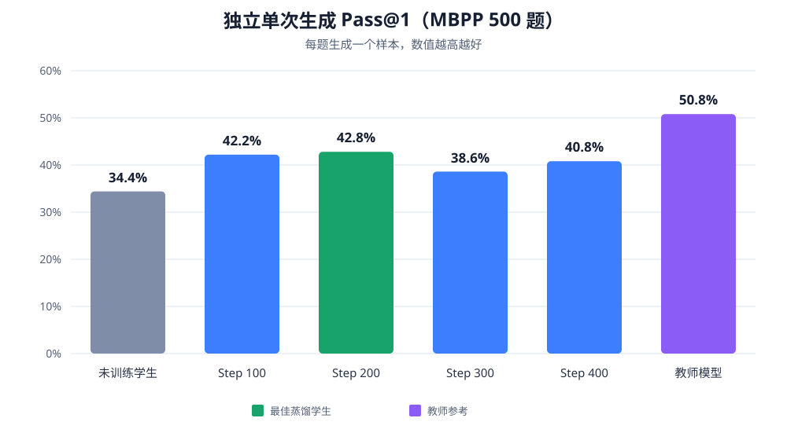
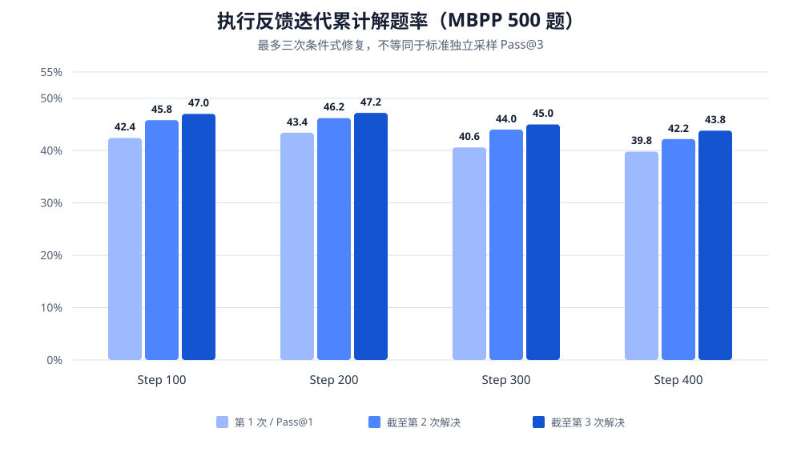

# OPD 蒸馏模型与 MBPP 评测结果说明

本目录汇总 Qwen3-1.7B 学生模型在 OPD 蒸馏前后、Qwen3-4B 教师模型，以及执行反馈迭代修复策略在 MBPP 测试集上的模型文件和评测结果。本文档依据目录内现有 `metrics.json` 汇总，最后更新于 **2026-08-28**。

## 结论摘要

- 标准独立单次生成中，当前最佳学生检查点是 **Step 200**：`pass@1 = 42.8%`，比未训练学生的 `34.4%` 提高 **8.4 个百分点**，相对提升约 **24.4%**。
- 教师模型 `pass@1 = 50.8%`，比最佳学生 Step 200 高 **8.0 个百分点**。学生仍有提升空间，但 OPD 已明显缩小差距。
- 训练步数与代码能力并非单调正相关：Step 300 降至 `38.6%`，Step 400 回升到 `40.8%`，仍低于 Step 200。因此不能仅凭训练 loss 或训练步数选择最终模型。
- 条件式执行反馈修复中，Step 200 在最多三次尝试后达到 **47.2%**，是当前最高的三次累计解题率；Step 100 的修复增益最大，从 `42.4%` 增至 `47.0%`，增加 **4.6 个百分点**。
- 当前目录**没有标准独立采样 `pass@3`**。现有 `iterative_pass@3` 是“失败后阅读反馈再修复”的累计成功率，不是 benchmark 常用的三份相互独立样本 `pass@3`。

## 评测协议

所有主要结果均使用同一份 500 题 MBPP 测试集，并采用以下共同配置：

| 配置项 | 值 |
|---|---:|
| 测试题数 | 500 |
| Thinking | 关闭 |
| Temperature | 1.0 |
| Top-p | 1.0 |
| 最大生成长度 | 1024 tokens |
| Seed | 42 |
| 推理精度 | bfloat16 |
| Attention | SDPA |

独立评测每题只生成 1 份代码，最大提示长度为 512 tokens。迭代反馈评测最多尝试 3 次，仅失败的题目继续生成；后续尝试会接收前一次代码和摘要式执行反馈，最大提示长度为 4096 tokens，且不会直接暴露隐藏测试断言。

## 独立生成：标准 Pass@1

| 模型 | 训练步数 | 通过题数 / 500 | Pass@1 | 相对未训练学生变化 |
|---|---:|---:|---:|---:|
| 未训练学生 Qwen3-1.7B | 0 | 172 | 34.4% | — |
| OPD 学生 Step 100 | 100 | 211 | 42.2% | **+7.8 pp** |
| **OPD 学生 Step 200** | **200** | **214** | **42.8%** | **+8.4 pp** |
| OPD 学生 Step 300 | 300 | 193 | 38.6% | **+4.2 pp** |
| OPD 学生 Step 400 | 400 | 204 | 40.8% | **+6.4 pp** |
| 教师 Qwen3-4B | — | 254 | 50.8% | **+16.4 pp** |

这里的 `pp` 表示百分点。比如 `42.8% - 34.4% = 8.4 pp`。

从结果看，OPD 的四个学生检查点都优于未训练学生，但 Step 200 最好。Step 300 和 Step 400 的回落说明继续增加训练步数可能产生策略漂移、过拟合或采样波动；在没有多随机种子重复实验前，不应把 Step 100 与 Step 200 之间仅 `0.6 pp` 的差距解释为确定性优势。

## 执行反馈迭代修复：最多三次尝试

| 模型 | 第 1 次成功率 | 截至第 2 次累计成功率 | 截至第 3 次累计成功率 | 第 1→3 次增益 | 首次失败后修复题数 |
|---|---:|---:|---:|---:|---:|
| Step 100 | 42.4% | 45.8% | 47.0% | **+4.6 pp** | 23 |
| **Step 200** | **43.4%** | **46.2%** | **47.2%** | **+3.8 pp** | 19 |
| Step 300 | 40.6% | 44.0% | 45.0% | **+4.4 pp** | 22 |
| Step 400 | 39.8% | 42.2% | 43.8% | **+4.0 pp** | 20 |

这一组结果证明，模型能够利用前一次失败及执行反馈修复一部分题目。Step 100 修复了最多的 23 道首次失败题，Step 200 的最终累计解题率最高，为 236/500，即 `47.2%`。

需要注意，表中的第 1 次成功率来自迭代评测的独立运行，受随机采样路径影响，与上一节独立评测的 `pass@1` 会有轻微差异。比较模型 benchmark 能力时，应以上一节统一的独立生成结果为主；比较“从错误中修复”的能力时，才使用本节结果。

## Pass@1、标准 Pass@3 与迭代 Pass@3 的区别

| 指标 | 含义 | 当前是否具备 | 推荐用途 |
|---|---|---|---|
| 标准 `pass@1` | 每题独立生成 1 个样本，该样本通过测试的概率 | **有** | 模型代码生成能力的主 benchmark 指标 |
| 标准 `pass@3` | 每题独立生成 3 个互不依赖的样本，至少 1 个通过的无偏估计 | **没有** | 衡量独立采样带来的覆盖率提升 |
| `iterative_solve_rate@3` / `iterative_pass@3` | 第 2、3 次可读取历史失败和执行反馈，统计三次内累计解决的题目比例 | **有** | 衡量执行反馈修复和从历史错误中学习的能力 |

因此，正式对外报告建议写成：

> Step 200 在 MBPP 500 题独立单样本评测上的 pass@1 为 42.8%；在摘要式执行反馈条件下，最多三次尝试的累计解题率为 47.2%。

不要直接写成“Step 200 的标准 pass@3 为 47.2%”。若需要标准 `pass@3`，应对每个模型重新执行 `generation_strategy=independent`、`samples_per_task=3` 的完整 500 题评测。

## 当前结果文件类型

### 1. 原始 FSDP 训练检查点

- `cloud_export_sigv1_nothink_step100/`
- `cloud_export_sigv1_nothink_step300/`

这类目录保存从云端导出的训练状态和分片参数，主要用于恢复训练或重新合并。当前本地只保留了 Step 100 与 Step 300 的这一类导出。

### 2. 已合并 Hugging Face 模型

- `mbpp_sigv1_nothink_step100_hf/`
- `mbpp_sigv1_nothink_step200_hf/`
- `mbpp_sigv1_nothink_step300_hf/`
- `mbpp_sigv1_nothink_step400_hf/`

每个目录均包含 `model.safetensors`、模型配置、tokenizer 和 `SHA256SUMS`，可直接用于本地推理与 MBPP 评测。

### 3. 独立单次生成评测

- `mbpp_eval_baseline_qwen3_1p7b_sigv1_policy_full/`：未训练学生基线。
- `mbpp_eval_sigv1_nothink_step{100,200,300,400}_policy_full/`：四个 OPD 学生检查点。
- `mbpp_eval_teacher/`：教师模型基准。

每个完整评测目录通常包含：

| 文件 | 内容 |
|---|---|
| `metrics.json` | 汇总指标，本文档主要数据来源 |
| `predictions.jsonl` | 每道题的提示、生成代码与判分结果 |
| `failures.jsonl` | 未通过样本及错误类型 |
| `run_config.json` | 模型路径与生成参数 |
| `evaluation.log` | 运行过程日志 |

### 4. 执行反馈三次迭代评测

四个 Step 均已有 `execution_feedback=summary`、最多 3 次尝试的完整 500 题结果，包括每次尝试的代码、反馈链、错误类型和累计解题率。

这些目录的名称目前包含一个意外换行和前导空格，例如逻辑名称为 `mbpp_eval_sigv1_nothink_step100 + _iterative3_summary_full`。这是之前 Shell 多行变量拼接造成的，只影响路径可读性，不影响其中的评测数据；本文档没有擅自重命名，以免破坏已有日志或脚本引用。

### 5. 合并、校验与训练日志

- `merge_sigv1_nothink_step*.log`：FSDP 合并记录。
- `validate_sigv1_nothink_step*.log`：合并后参数一致性检查。
- `cloud_export_*/logs/`：对应训练过程日志。
- `*.sha256` 与 `SHA256SUMS`：压缩包或模型文件完整性校验。

## 建议如何选用结果

- 用于论文或 benchmark 主表：优先报告独立生成 `pass@1`，当前最佳学生为 **Step 200（42.8%）**。
- 用于展示蒸馏效果：比较未训练学生 `34.4%`、最佳学生 `42.8%`、教师 `50.8%`。
- 用于展示错误修复能力：报告 `iterative_solve_rate@1/2/3` 及 `repair_gain@3`，当前最佳三次累计结果为 **Step 200（47.2%）**。
- 用于选择部署模型：当前首先考虑 Step 200；如果重视较短输出或其他效率指标，再另行结合延迟、token 数和显存占用评估。
- 用于严谨结论：建议补充标准独立 `pass@3`，并对主要模型使用多个随机种子重复评测，报告均值和置信区间。
